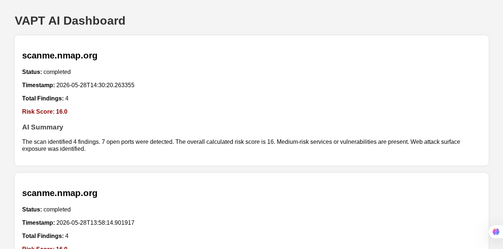
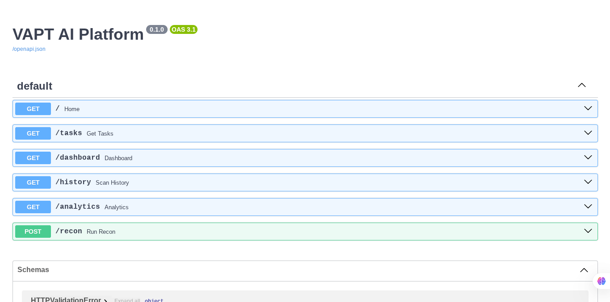
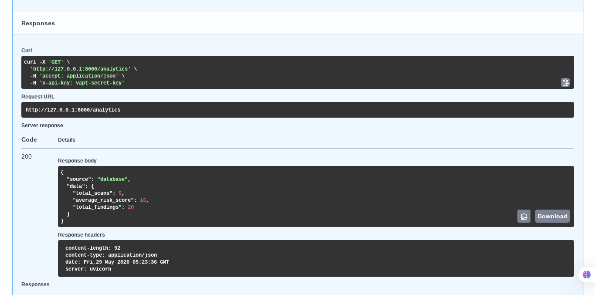

# VAPT AI Platform

## Overview

VAPT AI Platform is an AI-assisted Vulnerability Assessment and Penetration Testing (VAPT) automation platform built using FastAPI. The platform automates reconnaissance, vulnerability intelligence gathering, risk evaluation, report generation, and security recommendations through a modular agent-based architecture.

The project demonstrates modern backend engineering concepts including asynchronous execution, concurrent scanning, analytics APIs, authentication, caching, dashboard visualization, and automated reporting.

---

## Key Features

### Reconnaissance Automation

* Automated target reconnaissance
* Subdomain discovery using Subfinder
* Network scanning using Nmap
* Live host detection using httpx

### Vulnerability Intelligence

* Mock vulnerability assessment engine
* Attack surface identification
* Risk-based finding classification

### AI-Assisted Analysis

* Automated AI-style summaries
* Security recommendation generation
* Risk evaluation and prioritization

### Reporting System

* Markdown report generation
* JSON report generation
* Historical scan storage

### Dashboard & Analytics

* Web dashboard for scan visualization
* Scan history APIs
* Analytics APIs
* Cached intelligence retrieval

### Security Features

* API key authentication
* Environment-based configuration
* Protected API endpoints

### Performance Features

* Async task execution
* Concurrent scanning
* In-memory caching
* Background task processing

---

## Architecture

```text
Frontend Dashboard
        │
        ▼
FastAPI Backend
        │
        ▼
Authentication Layer
        │
        ▼
Async Task Execution
        │
        ▼
Recon Agent
        │
        ▼
Analysis Engine
        │
        ▼
AI Summary Engine
        │
        ▼
Recommendation Engine
        │
        ▼
Reporting System
        │
        ▼
SQLite Database
```

---

## Screenshots

### Dashboard



### Swagger API Documentation



### Analytics API



---

## Project Structure

```text
VAPT-AI-Platform/
│
├── agents/
│   └── recon_agent.py
│
├── analysis/
│   ├── ai_summary.py
│   ├── recommendation_engine.py
│   ├── recon_analyzer.py
│   └── risk_engine.py
│
├── config/
│   └── settings.py
│
├── database/
│   └── db_manager.py
│
├── security/
│   └── auth.py
│
├── templates/
│   └── dashboard.html
│
├── tools/
│   ├── httpx_tool.py
│   ├── mock_vuln_tool.py
│   ├── nmap_tool.py
│   └── subfinder_tool.py
│
├── utils/
│   ├── async_executor.py
│   ├── cache_manager.py
│   ├── logger.py
│   ├── report_generator.py
│   ├── storage_manager.py
│   └── task_manager.py
│
├── reports/
├── storage/
├── main.py
├── requirements.txt
├── README.md
└── .env
```

---

## Technology Stack

### Backend

* FastAPI
* Python 3.11+

### Database

* SQLite

### Frontend

* Jinja2 Templates
* HTML/CSS

### Security Tools

* Nmap
* Subfinder
* httpx

### Concurrency

* AsyncIO
* ThreadPoolExecutor

### Configuration

* Python Dotenv

---

## API Endpoints

### POST /recon

Starts a reconnaissance scan.

#### Request

```json
{
  "target": "scanme.nmap.org"
}
```

#### Response

```json
{
  "message": "Recon task queued",
  "target": "scanme.nmap.org"
}
```

---

### GET /tasks

Returns active and completed scan tasks.

---

### GET /history

Returns recent scan history.

Example:

```text
/history?limit=10
```

---

### GET /analytics

Returns platform analytics.

Example response:

```json
{
  "total_scans": 10,
  "average_risk_score": 14.2,
  "total_findings": 50
}
```

---

### GET /dashboard

Displays the web dashboard containing:

* Scan history
* Risk scores
* Findings
* AI summaries

---

## Authentication

Protected endpoints require an API key.

Header:

```text
x-api-key: vapt-secret-key
```

---

## Installation

### Clone Repository

```bash
git clone https://github.com/Anubhab36/VAPT-AI-Platform.git
cd VAPT-AI-Platform
```

### Create Virtual Environment

```bash
python -m venv venv
```

### Activate Virtual Environment

Linux/macOS:

```bash
source venv/bin/activate
```

Windows:

```bash
venv\Scripts\activate
```

### Install Dependencies

```bash
pip install -r requirements.txt
```

---

## Environment Configuration

Create a `.env` file:

```env
API_KEY=vapt-secret-key
APP_NAME=VAPT AI Platform
DEBUG=False
COMMAND_TIMEOUT=15
```

---

## Running the Platform

Start the server:

```bash
uvicorn main:app --reload
```

Open:

```text
Swagger UI:
http://127.0.0.1:8000/docs
```

```text
Dashboard:
http://127.0.0.1:8000/dashboard
```

---

## Sample Workflow

1. User submits a target.
2. Recon Agent launches concurrent scans.
3. Results are analyzed.
4. Risk scores are calculated.
5. AI summaries are generated.
6. Recommendations are produced.
7. Reports are generated.
8. Results are stored in SQLite.
9. Dashboard displays findings.
10. Analytics APIs provide intelligence insights.

---

## Future Enhancements

The current implementation represents an MVP focused on reconnaissance automation, analysis, and reporting.

Planned enterprise-grade enhancements include:

* Google ADK integration
* LLM-powered reasoning agents
* Neo4j attack graph modeling
* PostgreSQL migration
* Redis caching
* Docker-based agent isolation
* Nuclei integration
* OWASP ZAP integration
* SIEM integrations
* Continuous attack surface monitoring

---

## Learning Outcomes

This project demonstrates:

* Backend Engineering
* Async Programming
* Concurrent Execution
* API Security
* Database Design
* Analytics APIs
* Reporting Systems
* Full-Stack Integration
* Cybersecurity Automation
* Agent-Based Architecture

---

## Author

Anubhab Chakraborty

Computer Science Engineering Student

AI-Assisted Cybersecurity Platform Project
